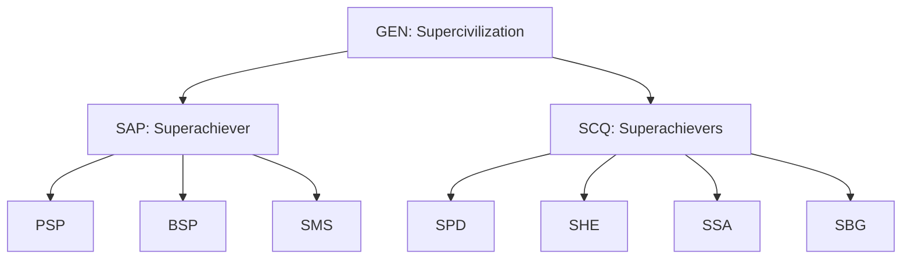

# Avolve: Regenerative Platform for Transformation

> Avolve is a next-generation, tokenized platform empowering individuals and communities to co-create a regenerative future through gamified engagement, transparent governance, and real-time data.

 

---

## 🚀 One-Pager

### Purpose
Avolve empowers individuals, communities, and ecosystems to co-create a regenerative future through transparent research, gamified engagement, and fractal governance.

### Problem
Most people and organizations are stuck in zero-sum, extractive systems (“Anticivilization”), leading to burnout, disengagement, and systemic stagnation. Current platforms focus on features, not transformation, and fail to align incentives or foster genuine collaboration.

### Solution
Avolve is a positive-sum, tokenized platform that transforms the journey from “Degen” to “Regen.” By combining gamified onboarding, real-time feedback, a multi-token system, and transparent governance, Avolve unlocks personal, collective, and ecosystem evolution. The 10-token structure aligns incentives and participation at every level.

### Why Now?
The convergence of Web3, real-time data, and regenerative economics makes it possible to build platforms that reward positive-sum behavior. The world is seeking new models for collaboration, belonging, and impact—Avolve meets this need with a proven, ready-to-launch product.

### Market Potential
Avolve targets individuals, DAOs, communities, and organizations seeking transformation, engagement, and regenerative impact. The market for regenerative platforms and digital communities is growing rapidly, with new markets emerging for tokenized governance and collective intelligence.

### Competition / Alternatives
Alternatives include traditional social networks, legacy DAO platforms, and gamified learning tools. Avolve’s unique combination of real-time feedback, tokenized governance, and regenerative economics sets it apart. The fractal, multi-token model is unmatched by competitors.

### Business Model
Avolve thrives through a mix of platform fees, token economics, premium features, and ecosystem partnerships. The model is designed for sustainability, growth, and reinvestment into the community.

### Team
Founded by Joshua Seymour and the Avolve DAO, the team brings expertise in product, governance, design, and community building. Contributors span multiple disciplines and geographies.

### Financials
Available upon request.

### Vision
In five years, Avolve will be the leading platform for regenerative transformation, powering a global network of Superachievers, Superachievers, and Supercivilizations—demonstrating that positive-sum systems can outcompete extractive models at scale.

---

## 📑 Table of Contents
- [Avolve DAO: Transparent Research & Documentation Hub](#-avolve-dao-transparent-research--documentation-hub)
- [Platform Overview](#-platform-overview)
- [Token System & Sacred Geometry](#-token-system--sacred-geometry)
- [User Journeys](#-user-journeys)
- [Feature Unlocking & Gamification](#-feature-unlocking--gamification)
- [Onboarding Flow](#-onboarding-flow)
- [Security & Data Integrity](#-security--data-integrity)
- [Featured Papers & Case Studies](#-featured-papers--case-studies)
- [Supporting Data](#-supporting-data)
- [Feedback, Suggestions, & Peer Review](#-feedback-suggestions--peer-review)
- [Repo Navigation](#-repo-navigation)

---

# 🌱 Avolve DAO: Transparent Research & Documentation Hub

Avolve DAO is an evolving, open research and documentation hub dedicated to personal, collective, and ecosystem transformation. Our mission is to transparently share experiments, user journeys, governance lessons, and real-world impact—empowering all stakeholders to co-create the future of regenerative organizations.

## 🧭 Purpose & Approach
- **Purpose:** To transform individuals, communities, and ecosystems through open research, gamified engagement, and transparent governance.
- **Approach:** We document every major experiment, user story, and governance learning—sharing both successes and failures.
- **Impact:** Real-world case studies, anonymized data, and actionable insights drive continuous improvement and collective wisdom.

## 🗺️ Platform Overview
Avolve is a next-generation, tokenized platform designed to guide users and communities from their current state to their highest potential. The platform is built around:
- **Magnetic Onboarding:** Personalized, gamified onboarding flows that celebrate every milestone.
- **Fractal Token System:** A 10-token architecture aligning incentives at individual, collective, and ecosystem levels.
- **Progressive Feature Unlocking:** Features become available as users and teams demonstrate engagement and impact.
- **Real-Time Engagement:** Live dashboards, notifications, and feedback loops.
- **Regenerative Governance:** Transparent, data-driven, and participatory decision-making.

## 🪙 Token System & Sacred Geometry
Avolve’s token system is inspired by sacred geometry and fractal patterns:
- **GEN (Supercivilization):** Ecosystem journey (Zinc gradient)
- **SAP (Superachiever):** Individual journey (Stone gradient)
  - **PSP:** Personal Success Puzzle (Amber-Yellow)
  - **BSP:** Business Success Puzzle (Teal-Cyan)
  - **SMS:** Supermind Superpowers (Violet-Purple-Fuchsia-Pink)
- **SCQ (Superachievers):** Collective journey (Slate gradient)
  - **SPD:** Superpuzzle Developments (Red-Green-Blue)
  - **SHE:** Superhuman Enhancements (Rose-Red-Orange)
  - **SSA:** Supersociety Advancements (Lime-Green-Emerald)
  - **SBG:** Supergenius Breakthroughs (Sky-Blue-Indigo)

**Token Allocation:**
- 10% to GEN (Supercivilization)
- 40% to SAP (Superachiever)
- 50% to SCQ (Superachievers)

**Weekly Token Schedule:**
- Sunday: SPD | Monday: SHE | Tuesday: PSP | Wednesday: SSA | Thursday: BSP | Friday: SGB | Saturday: SMS

**Learn more:** [Token System Paper](./docs/TOKEN-SYSTEM.md)

<!--

-->

## 🧬 User Journeys
- **Superachiever (Individual):** Personal and business transformation quests.
- **Superachievers (Collective):** Team and community co-creation.
- **Supercivilization (Ecosystem):** Impact at scale and regenerative governance.

Each journey features:
- **WCAG 2.2 AA** compliant design
- **Dark mode** with journey-themed gradients
- **Real-time engagement tracking**
- **Token-gated progressive features**
- **AI-enhanced interaction prompts**

## 🔓 Feature Unlocking & Gamification
Features are progressively unlocked based on participation and metrics:
- **Teams:** Unlocked by progress milestones
- **Governance:** Unlocked after accumulating 100 GEN tokens
- **Marketplace:** Unlocked after engagement milestones
- **Token Utility:** Unlocked after completing component progress milestones

**Metrics Tracked:**
- DAU/MAU Ratio, Retention, ARPU, NPS, Engagement

## 🧭 Onboarding Flow
Avolve delivers a magnetic onboarding experience:
- **Personalized Welcome:** Custom banner and checklist
- **Guided Actions:** Step-by-step onboarding checklist
- **Progress Tracking:** Live in `user_onboarding` table
- **Celebratory Milestones:** Confetti, tooltips, and badges

**Onboarding Table Schema:**
| Column           | Type        | Description                                     |
|------------------|-------------|-------------------------------------------------|
| id               | uuid        | Primary key                                     |
| user_id          | uuid        | References `auth.users(id)`                     |
| completed_steps  | text[]      | Array of completed onboarding step keys         |
| completed_at     | timestamptz | Timestamp when onboarding was fully completed   |
| created_at       | timestamptz | Row creation timestamp                          |
| updated_at       | timestamptz | Last update timestamp                           |

- **Row Level Security:** Only the user (and admins) can view or update their onboarding row.
- **Admin Controls:** Admins can view and manage onboarding progress for all users.

## 🛡️ Security & Data Integrity
- **Row Level Security (RLS)** on all user data tables
- **Role-Based Access Control (RBAC)** for admin actions
- **Token gating** for advanced features
- All data is live, real, and production-grade

**See:** [Database Docs](./docs/database.md)

## 📄 Featured Papers & Case Studies
- [2025 Onboarding Experiment: Magnetic User Delight](./papers/onboarding-experiment-2025.md)
- [DAO Governance: Real-World Lessons from Token Voting (2024)](./papers/governance-lessons-2024.md)
- See more in [`/papers`](./papers/README.md)

## 📊 Supporting Data
- [Onboarding 2025 Metrics](./data/onboarding-2025.json)
- [Governance Logs 2024](./data/governance-logs-2024.json)
- [Knowledge Graph](./data/knowledge-graph.jsonld)

## 🤝 Feedback, Suggestions, & Peer Review
- [Open an issue](https://github.com/avolve-dao/avolve.io/issues/new/choose) for feedback, suggestions, or to propose new research.
- Email [admin@avolve.io](mailto:admin@avolve.io) for collaboration or peer review.
- Join our [Community Discussions](https://github.com/avolve-dao/avolve.io/discussions) to help shape the future of Avolve DAO.

## 🗺️ Repo Navigation
- `/papers` — Token papers, experiments, and governance lessons
- `/docs` — Technical docs, tokenomics, architecture, and onboarding
- `/supabase` — Database schema, migrations, and security policies
- `/hooks`, `/components`, `/pages` — App source code

---

*For more, see the [Avolve website](https://avolve.io) or reach out directly. Together, we can co-create a regenerative future!*
