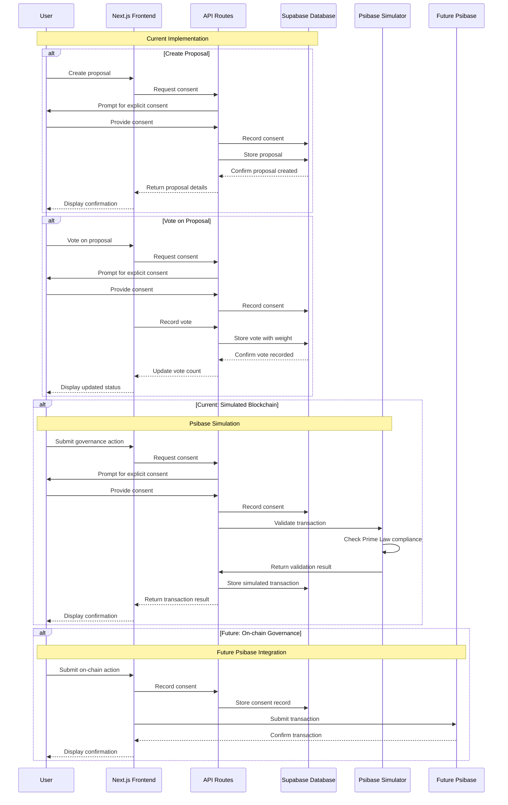

# Architecture Overview

This document provides an overview of the Avolve application architecture, design decisions, and technical implementation details.

> **Last Updated:** April 6, 2025  
> **Related Documents:** [Documentation Index](./index.md) | [Master Plan](./master-plan.md) | [Database Documentation](./avolve-database-documentation.md) | [Integration Assessment System](./integration-assessment-system.md)

## System Architecture

Avolve follows a modern web application architecture with the following key components:

### Frontend Architecture

```
┌─────────────────────────────────┐
│           Next.js App           │
├─────────────────────────────────┤
│                                 │
│  ┌─────────┐     ┌─────────┐   │
│  │  Pages  │     │  API    │   │
│  │         │     │ Routes  │   │
│  └─────────┘     └─────────┘   │
│                                 │
│  ┌─────────┐     ┌─────────┐   │
│  │Components│     │ Hooks   │   │
│  │         │     │         │   │
│  └─────────┘     └─────────┘   │
│                                 │
└─────────────────────────────────┘
            │
            ▼
┌─────────────────────────────────┐
│      Service Layer              │
│  ┌─────────┐     ┌─────────┐   │
│  │  Auth   │     │  Token  │   │
│  │ Service │     │ Service │   │
│  └─────────┘     └─────────┘   │
│                                 │
│  ┌─────────┐     ┌─────────┐   │
│  │Permission│     │ Audit   │   │
│  │ Service  │     │ Service │   │
│  └─────────┘     └─────────┘   │
│                                 │
│  ┌─────────┐     ┌─────────┐   │
│  │Notification    │Integration│ │
│  │ Service  │     │ Service │   │
│  └─────────┘     └─────────┘   │
│                                 │
│  ┌─────────┐                   │
│  │Notification                 │
│  │ Service  │                   │
│  └─────────┘                   │
└─────────────────────────────────┘
            │
            ▼
┌─────────────────────────────────┐
│        Supabase Client          │
└─────────────────────────────────┘
            │
            ▼
┌─────────────────────────────────┐
│        Supabase Backend         │
│  ┌─────────┐     ┌─────────┐   │
│  │PostgreSQL│     │  Auth   │   │
│  │ Database │     │ Service │   │
│  └─────────┘     └───────────┘  │
│                                 │
└─────────────────────────────────┘
```

### Key Components

1. **Next.js Application**
   - Server-side rendered React application
   - App Router for file-based routing
   - API Routes for server-side functionality

2. **Service Layer**
   - AuthService: Handles user authentication and session management
   - TokenService: Manages token operations, balances, and transfers
   - PermissionService: Handles user permissions and access control
   - NotificationService: Manages user notifications
   - AuditService: Tracks important system activities for security and compliance
   - IntegrationService: Manages integration assessment, profiles, and exercises

3. **Supabase Integration**
   - PostgreSQL database with optimized schema
   - Authentication service
   - Row-Level Security (RLS) policies
   - Real-time subscriptions
   - Database functions for complex operations

4. **Deployment Infrastructure**
   - Vercel for hosting the Next.js application
   - Supabase for database and authentication
   - GitHub Actions for CI/CD

## Design Patterns

### 1. Server Components and Client Components

The application leverages Next.js 15's server and client components:

- **Server Components**: Used for data fetching and rendering static content
- **Client Components**: Used for interactive elements and state management

Example of component separation:

```tsx
// Server Component
// app/dashboard/page.tsx
import { createClient } from "@/lib/supabase/server"
import { DashboardClient } from "./dashboard-client"

export default async function DashboardPage() {
  const supabase = await createClient()
  const { data: user } = await supabase.auth.getUser()
  
  return <DashboardClient user={user} />
}

// Client Component
// app/dashboard/dashboard-client.tsx
"use client"
import { useState } from "react"

export function DashboardClient({ user }) {
  const [isLoading, setIsLoading] = useState(false)
  
  // Interactive functionality here
  
  return (
    // UI components
  )
}
```

### 2. Service-Repository Pattern

The application implements a service-repository pattern for data access and business logic:

- **Services**: Encapsulate business logic and provide a clean API for components
- **Repositories**: Handle data access and communication with Supabase

Example of the service pattern:

```typescript
// lib/token/token-service.ts
import { SupabaseClient } from '@supabase/supabase-js';

export class TokenService {
  private client: SupabaseClient;

  constructor(client: SupabaseClient) {
    this.client = client;
  }

  async getAllTokens() {
    try {
      const { data, error } = await this.client
        .from('tokens')
        .select('*')
        .order('name');

      if (error) throw error;
      return { data, error: null };
    } catch (error) {
      console.error('Error getting tokens:', error);
      return { data: null, error };
    }
  }

  async transferTokensWithFee(fromUserId, toUserId, tokenId, amount) {
    // Business logic for token transfers with fee calculation
    // ...
  }
}
```

### 3. React Hooks for Service Access

Custom React hooks provide components with access to services:

```typescript
// lib/token/use-token.ts
import { useState, useCallback } from 'react';
import { useSupabase } from '../supabase/use-supabase';
import { TokenService } from './token-service';

export function useToken() {
  const { supabase } = useSupabase();
  const [tokenService] = useState(() => new TokenService(supabase));
  
  const transferTokens = useCallback(async (toUserId, tokenId, amount) => {
    // Implementation using tokenService
    // ...
  }, [tokenService]);

  return {
    // Exposed methods and state
    transferTokens,
    // ...
  };
}
```

### 4. Context Providers for Application State

Context providers make services and state available throughout the application:

```typescript
// lib/app-context.tsx
import { createContext, useContext, ReactNode } from 'react';
import { useAuth } from './auth/use-auth';
import { useToken } from './token/use-token';
import { useNotifications } from './notifications/use-notifications';

const AppContext = createContext(null);

export function AppProvider({ children }: { children: ReactNode }) {
  const auth = useAuth();
  const token = useToken();
  const notifications = useNotifications();

  return (
    <AppContext.Provider value={{ auth, token, notifications }}>
      {children}
    </AppContext.Provider>
  );
}

export function useApp() {
  return useContext(AppContext);
}
```

### 5. Authentication Flow

The authentication flow uses Supabase Auth with the following pattern:

1. User submits credentials via client-side form
2. Supabase client processes authentication request
3. On success, session is stored in cookies
4. Server-side components can access the authenticated session

## Governance and Consent Architecture

The Avolve platform implements a comprehensive governance and consent system that adheres to The Prime Law's principles of voluntary participation. This section outlines the technical implementation of these features.

### Governance System Components



### Technical Implementation

#### 1. Governance Dashboard Component

The Governance Dashboard (`app/governance/governance-dashboard.tsx`) is a client-side React component that:

- Displays active, approved, and rejected proposals
- Provides interfaces for creating proposals and voting
- Implements consent checkboxes for all governance actions
- Uses the `useGovernance` hook for data fetching and mutations

#### 2. Consent History Component

The Consent History component (`app/governance/consent-history.tsx`) allows users to:

- View their consent records with filtering options
- Manage their consent status (e.g., revoke consent)
- Download their consent history for record-keeping

#### 3. API Endpoints

The platform implements several API endpoints for governance and consent:

- `/api/governance/proposals`: CRUD operations for proposals
- `/api/governance/votes`: Managing votes on proposals
- `/api/consent`: Recording and retrieving consent records

#### 4. Database Schema

The governance and consent features rely on the following database tables:

- `petitions`: Stores proposal data including title, description, status
- `votes`: Records votes on petitions with user ID and vote weight
- `user_consent`: Tracks all consent records with detailed terms and metadata

#### 5. Service Layer

The governance and consent features are implemented through several services:

- `GovernanceService`: Manages proposal creation, voting, and status updates
- `TokenService`: Handles token operations with consent checks
- `ConsentService`: Records and verifies user consent for various actions

### Consent Flow

The consent flow follows these steps:

1. **Request Consent**: User is presented with consent terms before an action
2. **Record Consent**: Upon approval, consent is recorded with detailed terms
3. **Verify Consent**: Before executing an action, consent is verified
4. **Execute Action**: The requested action is performed only after consent verification
5. **Audit Trail**: All consent actions are recorded for transparency

### Integration with Token System

The governance system integrates with the token system in several ways:

- **Eligibility Checks**: Token balances determine eligibility for proposal creation
- **Voting Weight**: Token holdings influence voting power
- **Reward Distribution**: Governance participation may be rewarded with tokens
- **Consent for Transfers**: Token transfers require explicit consent

### Future Architecture: Psibase Integration

The current architecture is designed to facilitate future integration with Psibase blockchain:

- **Hybrid Approach**: Maintaining off-chain governance with on-chain execution
- **Consent Bridge**: Ensuring consent records are maintained across systems
- **Transaction Signing**: Adding cryptographic signatures to consent records
- **State Synchronization**: Keeping on-chain and off-chain state in sync

## Simulating Smart Contracts

The Avolve platform implements a simulation layer for blockchain functionality to prepare for future integration with Psibase while maintaining compliance with The Prime Law principles.

### Psibase Simulator

The Psibase Simulator (`lib/psibase/PsibaseSimulator.ts`) provides a way to validate and process governance transactions in a manner that mimics how they would be handled on a blockchain:

```typescript
export class PsibaseSimulator {
  private supabase: SupabaseClient;
  
  constructor(supabase: SupabaseClient) {
    this.supabase = supabase;
  }
  
  async validateTransaction(transaction: PsibaseTransaction): Promise<ValidationResult> {
    // Check for required consent
    const consentResult = await this.verifyConsent(transaction.userId, transaction.action);
    if (!consentResult.valid) {
      return {
        valid: false,
        error: 'Transaction violates The Prime Law: Missing explicit consent',
        details: consentResult.details
      };
    }
    
    // Validate transaction based on action type
    switch (transaction.action) {
      case 'create_proposal':
        return this.validateProposalCreation(transaction);
      case 'vote':
        return this.validateVote(transaction);
      default:
        return {
          valid: false,
          error: `Unknown action type: ${transaction.action}`,
          details: null
        };
    }
  }
  
  async processTransaction(transaction: PsibaseTransaction): Promise<TransactionResult> {
    // First validate the transaction
    const validationResult = await this.validateTransaction(transaction);
    if (!validationResult.valid) {
      return {
        success: false,
        error: validationResult.error,
        transactionId: null
      };
    }
    
    // Record the transaction in the database
    const { data, error } = await this.supabase
      .from('psibase_transactions')
      .insert({
        user_id: transaction.userId,
        action: transaction.action,
        payload: transaction.payload,
        status: 'confirmed',
        metadata: {
          simulation_time: new Date().toISOString(),
          validation_result: validationResult
        }
      })
      .select('id')
      .single();
      
    if (error) {
      return {
        success: false,
        error: 'Failed to record transaction',
        transactionId: null
      };
    }
    
    // Process the transaction based on action type
    switch (transaction.action) {
      case 'create_proposal':
        return this.processProposalCreation(transaction, data.id);
      case 'vote':
        return this.processVote(transaction, data.id);
      default:
        return {
          success: false,
          error: `Unknown action type: ${transaction.action}`,
          transactionId: data.id
        };
    }
  }
}
```

### API Integration

The Psibase Simulator is integrated through a dedicated API route (`app/api/psibase/route.ts`):

```typescript
import { NextRequest, NextResponse } from 'next/server';
import { createRouteHandlerClient } from '@supabase/auth-helpers-nextjs';
import { cookies } from 'next/headers';
import { PsibaseSimulator } from '@/lib/psibase/PsibaseSimulator';

export async function POST(req: NextRequest) {
  try {
    const supabase = createRouteHandlerClient({ cookies });
    
    // Verify authentication
    const { data: { user } } = await supabase.auth.getUser();
    if (!user) {
      return NextResponse.json(
        { error: 'Unauthorized' },
        { status: 401 }
      );
    }
    
    // Parse the transaction request
    const body = await req.json();
    const transaction = {
      userId: user.id,
      action: body.action,
      payload: body.payload
    };
    
    // Process the transaction
    const simulator = new PsibaseSimulator(supabase);
    const result = await simulator.processTransaction(transaction);
    
    return NextResponse.json(result);
  } catch (error) {
    console.error('Error processing Psibase transaction:', error);
    return NextResponse.json(
      { error: 'Internal server error' },
      { status: 500 }
    );
  }
}
```

### Database Structure

The simulation uses a `psibase_transactions` table to store transaction records:

```sql
create table public.psibase_transactions (
  id uuid primary key default gen_random_uuid(),
  user_id uuid not null references auth.users(id) on delete cascade,
  action text not null,
  payload jsonb not null,
  status text not null,
  metadata jsonb,
  created_at timestamp with time zone default now(),
  updated_at timestamp with time zone default now()
);

-- Add indexes for performance
create index idx_psibase_transactions_user_id on public.psibase_transactions(user_id);
create index idx_psibase_transactions_action on public.psibase_transactions(action);
create index idx_psibase_transactions_status on public.psibase_transactions(status);

-- Add RLS policies
alter table public.psibase_transactions enable row level security;

-- Users can view their own transactions
create policy "Users can view their own transactions"
on public.psibase_transactions
for select using (user_id = auth.uid());
```

### Prime Law Compliance

The Psibase Simulator enforces The Prime Law principles by:

1. **Verifying Explicit Consent**: Every transaction requires explicit consent records
2. **Validating Transaction Rules**: Ensuring transactions follow governance rules
3. **Maintaining Transparency**: Recording all transaction details for audit
4. **Providing Feedback**: Returning clear validation results to users

### Future Psibase Integration

This simulation layer prepares the platform for future integration with Psibase by:

1. **Mimicking Blockchain Behavior**: Using similar validation and transaction patterns
2. **Maintaining Compatibility**: Structuring data in a way that can be migrated to blockchain
3. **Enforcing Consent**: Establishing consent patterns that will translate to on-chain governance
4. **Building User Familiarity**: Getting users accustomed to blockchain-like interactions

When the platform transitions to actual Psibase integration, the simulation layer will be replaced with real blockchain interactions, but the user experience and consent mechanisms will remain consistent.

## Data Flow

### Authentication Flow

```
┌──────────┐    ┌───────────┐    ┌──────────────┐
│  Login   │    │ Supabase  │    │  Next.js     │
│  Form    │───▶│   Auth    │───▶│  Middleware  │
└──────────┘    └───────────┘    └──────────────┘
                      │                  │
                      ▼                  ▼
                ┌───────────┐    ┌──────────────┐
                │  Session  │    │  Protected   │
                │  Cookies  │◀───│    Routes    │
                └───────────┘    └──────────────┘
```

### Token Transfer Flow

```
┌──────────┐    ┌───────────┐    ┌──────────────┐
│  User    │    │  Token    │    │  Token       │
│  Action  │───▶│  Service  │───▶│  Validation  │
└──────────┘    └───────────┘    └──────────────┘
                                         │
                                         ▼
┌──────────┐    ┌───────────┐    ┌──────────────┐
│  Update  │    │ Calculate │    │  Database    │
│  UI      │◀───│ Fee       │◀───│  Transaction │
└──────────┘    └───────────┘    └──────────────┘
                                         │
                                         ▼
                                  ┌──────────────┐
                                  │  Audit       │
                                  │  Logging     │
                                  └──────────────┘
```

### Notification Flow

```
┌──────────┐    ┌───────────┐    ┌──────────────┐
│  System  │    │Notification│    │  Database    │
│  Event   │───▶│  Service  │───▶│  Insert      │
└──────────┘    └───────────┘    └──────────────┘
                                         │
                                         ▼
┌──────────┐    ┌───────────┐    ┌──────────────┐
│  UI      │    │ Real-time │    │  Notification│
│  Update  │◀───│ Update    │◀───│  Created     │
└──────────┘    └───────────┘    └──────────────┘
```

### Integration Assessment Flow

```
┌──────────┐    ┌───────────┐    ┌──────────────┐
│  User    │    │Assessment │    │  Response    │
│  Response│───▶│  Service  │───▶│  Storage     │
└──────────┘    └───────────┘    └──────────────┘
                      │                  │
                      ▼                  ▼
                ┌───────────┐    ┌──────────────┐
                │ Calculate │    │ Integration  │
                │  Profile  │───▶│    Profile   │
                └───────────┘    └──────────────┘
                                         │
                                         ▼
                                  ┌──────────────┐
                                  │  Token       │
                                  │  Rewards     │
                                  └──────────────┘
```

## Security Considerations

### 1. Authentication Security

- CSRF protection for all authentication forms
- Secure HTTP-only cookies for session management
- Rate limiting on authentication endpoints
- Email verification for new accounts

### 2. Database Security

- Row-Level Security (RLS) policies for all tables
- Parameterized queries to prevent SQL injection
- Least privilege principle for database access
- Secure database functions with `security invoker` and proper `search_path`
- Audit logging for sensitive operations

### 3. API Security

- Input validation for all API endpoints
- Rate limiting for API routes
- Security headers via middleware

## Performance Optimizations

- Server components for reduced client-side JavaScript
- Static generation for non-dynamic pages
- Image optimization via Next.js Image component
- Edge middleware for fast security checks
- Database indexes for frequently queried columns
- Optimized token transfer operations with proper validation and error handling

## Future Architecture Considerations

- **Caching Strategy**: Implementing Redis for caching frequently accessed data
- **Serverless Functions**: Moving complex operations to dedicated serverless functions
- **WebSockets**: Enhancing real-time capabilities with WebSocket connections
- **Microservices**: Breaking down the application into smaller, specialized services as it grows

## Code Organization

### Directory Structure

```
avolve/
├── app/                  # Next.js App Router pages
│   ├── (route-groups)/   # Route groups for related pages
│   ├── api/              # API routes
│   └── auth/             # Authentication pages
├── components/           # Reusable UI components
│   ├── ui/               # Base UI components
│   └── feature-specific/ # Feature-specific components
├── contexts/             # React context providers
├── hooks/                # Custom React hooks
├── lib/                  # Utility functions and configurations
│   ├── auth/             # Authentication services and hooks
│   ├── token/            # Token services and hooks
│   ├── notifications/    # Notification services and hooks
│   ├── audit/            # Audit services
│   ├── utils/            # Utility functions
│   └── supabase/         # Supabase client configuration
├── public/               # Static assets
├── styles/               # Global styles
└── supabase/             # Supabase configuration
    └── migrations/       # Database migrations
```

### Key Files

- `middleware.ts`: Handles authentication, security headers, and rate limiting
- `lib/supabase/client.ts`: Client-side Supabase client
- `lib/supabase/server.ts`: Server-side Supabase client with cookie management
- `lib/auth/auth-service.ts`: Authentication service
- `lib/token/token-service.ts`: Token management service
- `lib/notifications/notification-service.ts`: Notification service
- `lib/audit/audit-service.ts`: Audit logging service
- `lib/app-context.tsx`: Application-wide context provider
- `lib/utils/database-initializer.ts`: Database initialization utilities
