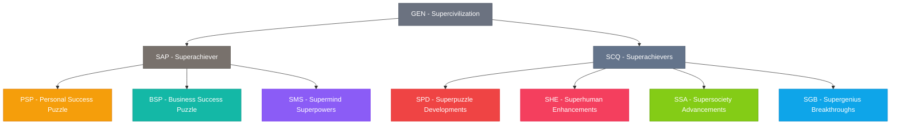
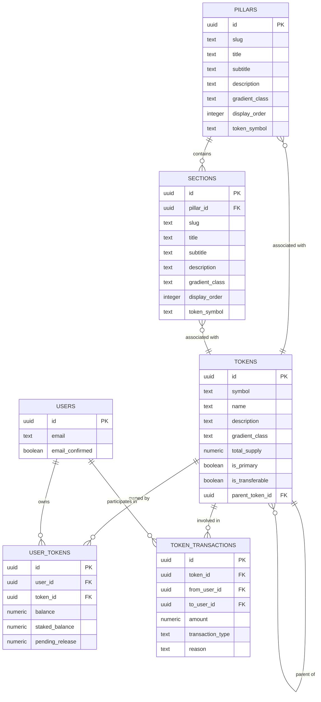
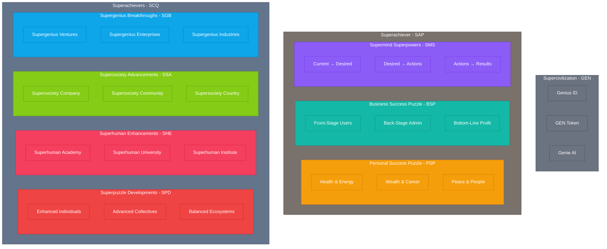

# 🚀 Avolve Database Documentation


> **Version:** 1.0.0  
> **Last Updated:** April 6, 2025  
> **Status:** Active Development

## 📊 Overview

The Avolve platform is built on a sophisticated token-based access control system that aligns with the platform's three main pillars:

1. **Superachiever** - Individual journey of transformation
2. **Superachievers** - Collective journey of transformation
3. **Supercivilization** - Ecosystem journey for transformation

This documentation provides a comprehensive overview of the database schema, token structure, and access control mechanisms that power the Avolve platform.

## 🧩 Token Structure

The token structure follows a hierarchical model that mirrors the platform's three pillars:



## 📝 Core Tables

### `tokens`

Stores information about all tokens in the system.

| Column | Type | Description |
|--------|------|-------------|
| id | uuid | Primary key |
| symbol | text | Token symbol (e.g., GEN, SAP) |
| name | text | Token name |
| description | text | Token description |
| icon_url | text | URL to token icon |
| gradient_class | text | CSS gradient class for UI |
| total_supply | numeric | Total supply of tokens |
| is_primary | boolean | Whether this is a primary token |
| blockchain_contract | text | Contract address (for future blockchain integration) |
| chain_id | text | Blockchain chain ID |
| created_at | timestamptz | Creation timestamp |
| updated_at | timestamptz | Last update timestamp |
| is_active | boolean | Whether the token is active |
| is_transferable | boolean | Whether the token can be transferred |
| transfer_fee | numeric | Fee for token transfers |
| parent_token_id | uuid | Reference to parent token |

### `user_tokens`

Tracks token ownership for each user.

| Column | Type | Description |
|--------|------|-------------|
| id | uuid | Primary key |
| user_id | uuid | Reference to auth.users |
| token_id | uuid | Reference to tokens |
| balance | numeric | Available token balance |
| staked_balance | numeric | Staked token balance |
| pending_release | numeric | Tokens pending release |
| created_at | timestamptz | Creation timestamp |
| updated_at | timestamptz | Last update timestamp |
| last_updated | timestamptz | Last balance update |

### `token_transactions`

Records all token transactions.

| Column | Type | Description |
|--------|------|-------------|
| id | uuid | Primary key |
| token_id | uuid | Reference to tokens |
| from_user_id | uuid | Sender (null for minting) |
| to_user_id | uuid | Recipient (null for burning) |
| amount | numeric | Transaction amount |
| transaction_type | text | Type (transfer, reward, etc.) |
| reason | text | Transaction reason |
| tx_hash | text | Blockchain transaction hash |
| created_at | timestamptz | Transaction timestamp |

### `pillars`

Represents the three main pillars of the platform.

| Column | Type | Description |
|--------|------|-------------|
| id | uuid | Primary key |
| slug | text | URL-friendly identifier |
| title | text | Pillar title |
| subtitle | text | Pillar subtitle |
| description | text | Pillar description |
| icon | text | Icon identifier |
| gradient_class | text | CSS gradient class |
| display_order | integer | Display order |
| created_at | timestamptz | Creation timestamp |
| updated_at | timestamptz | Last update timestamp |
| token_symbol | text | Associated token symbol |
| chain_id | text | Blockchain chain ID |

### `sections`

Represents sections within pillars.

| Column | Type | Description |
|--------|------|-------------|
| id | uuid | Primary key |
| pillar_id | uuid | Reference to pillars |
| slug | text | URL-friendly identifier |
| title | text | Section title |
| subtitle | text | Section subtitle |
| description | text | Section description |
| icon | text | Icon identifier |
| gradient_class | text | CSS gradient class |
| display_order | integer | Display order |
| created_at | timestamptz | Creation timestamp |
| updated_at | timestamptz | Last update timestamp |
| token_symbol | text | Associated token symbol |
| chain_id | text | Blockchain chain ID |

## 🔄 Entity-Relationship Diagram



## 🔐 Token-Based Access Control

The Avolve platform implements a token-based access control system that determines user access to different parts of the platform based on token ownership.

### Key Functions

```sql
-- Check if a user has a specific token
has_token(user_id, token_symbol)

-- Check if a user has sufficient token balance
has_sufficient_token_balance(user_id, token_symbol, required_amount)

-- Get token hierarchy
get_token_hierarchy()
```

## 🚀 Platform Structure

The platform structure mirrors the token hierarchy:



## 📊 Current State Assessment

### Strengths

1. **Hierarchical Token Structure**: The database successfully implements a hierarchical token structure that aligns with the platform's three pillars.
2. **Pillar-Section Relationship**: The database captures the relationship between pillars and sections, with each section associated with a specific token.
3. **Token Ownership Tracking**: The database includes tables for tracking token ownership and transactions.

### Gaps and Recommendations

1. **Token Staking and Rewards**: 
   - **Gap**: The database has tables for token staking and rewards, but they're not fully implemented.
   - **Recommendation**: Implement the token staking and rewards functionality to enable users to stake tokens and earn rewards.

2. **User Progress Tracking**:
   - **Gap**: While the database has tables for tracking user progress through pillars, sections, and components, they're not fully implemented.
   - **Recommendation**: Implement the user progress tracking functionality to enable users to track their progress through the platform.

3. **Token-Based Access Control**:
   - **Gap**: The database has functions for checking token ownership, but the access control mechanisms aren't fully implemented.
   - **Recommendation**: Implement row-level security policies that use token ownership to control access to different parts of the platform.

4. **Blockchain Integration**:
   - **Gap**: The database includes fields for blockchain integration, but they're not being used yet.
   - **Recommendation**: Prepare for future integration with Psibase by implementing bridge components for data synchronization.

## 🚀 Implementation Roadmap

Based on our assessment, we recommend the following implementation roadmap:

1. **Phase 1: Core Token System (Immediate)**
   - Complete the implementation of token staking and rewards
   - Implement token-based access control with row-level security
   - Create UI components for token visualization

2. **Phase 2: User Experience (Short-term)**
   - Implement user progress tracking
   - Develop gamification features
   - Create engaging onboarding flows

3. **Phase 3: Community Features (Medium-term)**
   - Implement community building features
   - Develop consensus mechanisms
   - Create tools for community governance

4. **Phase 4: Blockchain Preparation (Long-term)**
   - Prepare for Psibase integration
   - Implement bridge components
   - Test data synchronization

5. **Phase 5: Full Decentralization (When Psibase is Available)**
   - Migrate to Psibase for blockchain operations
   - Implement full decentralized features
   - Maintain Supabase for user management

## 📝 Conclusion

The Avolve database is well-structured to support the platform's token-based access system and hierarchical organization. By implementing the recommendations in this document, the platform will be able to deliver a compelling user experience while preparing for future technological advancements.

---

<div style="text-align: center; margin-top: 50px;">
<p>© 2025 Avolve Platform. All rights reserved.</p>
<p>Created with ❤️ by the Avolve Team</p>
</div>
