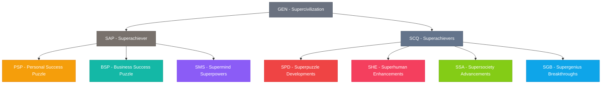

# 🚀 Avolve Database Documentation


> **Version:** 1.3.0  
> **Last Updated:** April 6, 2025  
> **Status:** MVP Implementation with Declarative Schema
> **Related Documents:** [Documentation Index](./index.md) | [Master Plan](./master-plan.md) | [Architecture Overview](./architecture.md) | [Integration Assessment System](./integration-assessment-system.md)

## 📊 Overview

The Avolve platform is built on a token-based access control system that aligns with the platform's three main pillars, with a focus on gamification principles to enhance user engagement. The MVP implementation prioritizes the Discovery and Onboarding phases of the user journey.

1. **Superachiever** - Individual journey of transformation
2. **Superachievers** - Collective journey of transformation
3. **Supercivilization** - Ecosystem journey for transformation

This documentation provides an overview of the database schema, token structure, and access control mechanisms that power the Avolve platform MVP.

## 🎮 Gamification Framework

The Avolve platform implements the 4 Experience Phases of Gamification:

1. **Discovery** - Users discover the platform and understand its value proposition
2. **Onboarding** - Users learn the basic mechanics and earn their first tokens
3. **Scaffolding** - Users engage in regular activities to progress through the platform
4. **Endgame** - Veteran users contribute to the community and access exclusive content

The MVP focuses primarily on the Discovery and Onboarding phases to provide immediate value while collecting data to inform future development.

### Integration Assessment System

A key component of the gamification framework is the **Integration Assessment System**, which helps users identify and strengthen connections between different domains of their transformation journey. This system:

- Provides personalized integration profiles based on assessment responses
- Visualizes integration strengths and opportunities through an interactive map
- Recommends targeted exercises to improve integration
- Rewards users with tokens for completing assessments and exercises

The Integration Assessment System addresses the core need of emerging superachievers in 2025: integration across fragmented domains of life and work.

## 👥 User & Admin Roles

The Avolve platform implements a role-based access control system alongside the token-based system, providing flexible permission management.

### User Roles

| Role | Description | Permissions |
|------|-------------|-------------|
| **Subscriber** | Basic access to platform content | View content, earn tokens |
| **Participant** | Can participate in community activities | View content, earn tokens, participate in discussions, submit feedback |
| **Contributor** | Can contribute content to the platform | All participant permissions plus ability to contribute content |

### Admin Roles

| Role | Description | Permissions |
|------|-------------|-------------|
| **Associate** | Helping with platform operations | All contributor permissions plus content moderation and user management |
| **Builder** | Building platform features | All associate permissions plus platform management |
| **Partner** | Funding and strategic direction | All builder permissions plus financial management |

These roles are implemented using Supabase's Row Level Security (RLS) policies and declarative schema approach, ensuring secure and consistent access control throughout the platform.

## 🧩 Token Structure

The token structure follows a hierarchical model that mirrors the platform's three pillars:



## 🔐 Access Control System

The Avolve platform implements a hybrid access control system that combines:

1. **Token-Based Access Control**: Users need specific tokens to access certain content
2. **Role-Based Access Control**: User roles provide baseline permissions and access levels
3. **Gamification-Based Access**: Users in early phases (Discovery, Onboarding) get special access to introductory content

This hybrid approach ensures:
- New users can experience enough of the platform to understand its value
- Advanced content remains exclusive to users who have earned the required tokens
- Administrative functions are restricted to appropriate admin roles

## 📋 Database Schema

The database is implemented using Supabase with a declarative schema approach, following best practices for security and performance.

### Declarative Schema Structure

The database follows Supabase's declarative schema approach, with the following organization:

```
supabase/
├── migrations/                # Migration files for database changes
│   ├── 20240406154125_add_user_and_admin_roles.sql
│   ├── 20240406154500_implement_declarative_schema.sql
│   ├── 20240906123045_add_user_activity_logs.sql
│   └── ...
├── schemas/                   # Declarative schema definitions
│   ├── public/                # Public schema
│   │   ├── tables.sql         # Table definitions
│   │   ├── policies.sql       # RLS policies
│   │   ├── functions.sql      # Main functions file (imports modules)
│   │   └── functions/         # Function modules
│   │       ├── role_functions.sql
│   │       ├── token_functions.sql
│   │       └── gamification_functions.sql
│   └── schema.sql             # Main schema file
└── seed/                      # Seed data for development
```

This structure provides several benefits:
- Clear separation of concerns
- Easier maintenance and collaboration
- Better version control
- Simplified deployment
- Improved documentation

### Core Tables

- **roles**: Defines all user and admin roles with their permissions
- **user_roles**: Assigns roles to users with optional expiration
- **tokens**: Defines all token types in the platform
- **user_tokens**: Tracks token ownership for each user
- **token_transactions**: Records token transfers and rewards
- **pillars**: The three main content pillars of the platform
- **sections**: Subdivisions within each pillar
- **components**: Individual content pieces within sections
- **user_progress**: Tracks user progress through content
- **user_achievements**: Tracks user achievements and rewards
- **user_activity_logs**: Records user actions for analytics and gamification
- **integration_assessment_questions**: Stores questions for evaluating domain integration
- **integration_assessment_responses**: Records user responses to assessment questions
- **integration_profiles**: Stores calculated integration scores and personalized paths
- **integration_exercises**: Contains guided exercises for improving domain integration
- **user_exercise_progress**: Tracks user progress through integration exercises
- **integration_journey_milestones**: Records significant milestones in integration journey

### Security Implementation

All tables implement Row Level Security (RLS) policies to ensure users can only access data they are authorized to see. The security model follows these principles:

1. **Least Privilege**: Users only have access to what they need
2. **Defense in Depth**: Multiple security layers (tokens, roles, RLS)
3. **Declarative Policies**: Security rules defined as declarative policies
4. **Automatic Role Assignment**: New users automatically get the Subscriber role

## 🔧 Database Functions

The platform uses PostgreSQL functions to implement business logic and enforce security. All functions follow these best practices:

1. **Security Invoker**: Functions run with the permissions of the calling user
2. **Explicit Search Path**: All functions set `search_path = ''` to avoid security risks
3. **Fully Qualified Names**: All database objects are referenced with schema prefixes
4. **Error Handling**: Proper error handling and reporting
5. **Modular Organization**: Functions are organized by domain in separate files

### Key Function Categories

- **Role Functions**: Manage user roles and permissions
- **Token Functions**: Handle token-related operations and access checks
- **Gamification Functions**: Implement gamification features like achievements and progress tracking

## 📊 User Activity Tracking

The platform tracks user activity for analytics and gamification purposes. This data is used to:

1. **Personalize Recommendations**: Suggest relevant content based on user behavior
2. **Award Achievements**: Recognize user accomplishments
3. **Track Progress**: Monitor user journey through the platform
4. **Identify Engagement Patterns**: Understand how users interact with the platform

## 🚀 Next Steps

As the platform evolves, the database will be extended to support:

1. **Community Features**: Forums, discussions, and collaboration tools
2. **Advanced Analytics**: More sophisticated tracking and reporting
3. **Enhanced Personalization**: More tailored user experiences
4. **Integration with Blockchain**: Preparation for future token economy

---

<div style="text-align: center; margin-top: 50px;">
<p>🚀 Avolve Platform</p>
<p>👋 Created with ❤️ by the Avolve Team</p>
</div>
