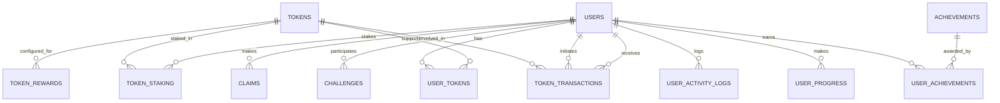

# Database Schema & API Documentation: Avolve Tokenomics

This document provides an overview of the key database tables, relationships, and API (RPC) functions that power Avolve’s gamification and tokenomics systems. It is intended for both developers and admins.

---

## 1. Core Tables

### **tokens**

- Stores all platform tokens (GEN, SAP, PSP, BSP, SMS, SCQ, SPD, SHE, SSA, SBG)
- Columns: id, symbol, name, pillar, color, description, created_at, etc.

### **user_tokens**

- Tracks each user’s balance for each token
- Columns: user_id, token_id, balance, staked_balance, pending_release, created_at, updated_at

### **token_transactions**

- Full audit trail of all token movements
- Columns: id, token_id, from_user_id, to_user_id, amount, transaction_type, reason, metadata, created_at

### **token_rewards, token_staking, achievements, user_progress, user_activity_logs**

- Tables for gamified actions, rewards, staking, progress, and analytics

### **challenges, claims**

- Tables for gamified actions, progress, and rewards

### **user_admin_stories, metrics, onboarding, etc.**

- Support tables for engagement, analytics, and onboarding flows

---

## 2. Relationships

- **user_tokens** references **auth.users** and **tokens**
- **token_transactions** references **auth.users** and **tokens**
- **achievements/progress/activity** reference **users** and content/challenge definitions
- **challenges/claims** reference **users** and challenge definitions

---

## 3. Key RPC Functions (API)

### **reward_user(user_id, token_symbol, activity_type, custom_amount, custom_multiplier)**

- Atomically awards tokens for an activity, updates balances and transactions

### **transfer_tokens(from_user_id, to_user_id, token_symbol, amount, reason)**

- Secure peer-to-peer token transfer

### **spend_gen_tokens(user_id, amount, reason)**

- Burns GEN tokens for platform features

### **get_user_transactions(user_id)**

- Returns all transactions for a user

### **get_token_supply_stats(token_id)**

- Returns supply and distribution stats for a token

### **get_user_achievements(user_id)**

- Returns all achievements (earned and claimed) for a user

---

## 4. Security & RLS Policies

- **Row Level Security** is enabled on all user-specific tables
- **Policies** ensure users can only access/modify their own data
- **Admin roles** have broader access for analytics and corrections

---

## 5. ER Diagram

Below is a simplified Entity Relationship Diagram (ERD) representing the core gamification and tokenomics tables and their relationships:

> For a full, interactive diagram, see the Supabase dashboard or import the schema into dbdiagram.io.

---

## 6. Best Practices

- All migrations and functions are documented and commented
- Destructive changes are always explained in migration files
- Use explicit typing and error handling in all SQL functions

---

## 7. Further Reading

- [Tokenomics at a Glance](./tokenomics-at-a-glance.md)
- [User Quickstart Guide](./user-quickstart.md)
- [Admin/Dev Onboarding](./admin-onboarding.md)

---

For any questions or updates, contact the Avolve core team or reference the latest migrations and Supabase project dashboard.
