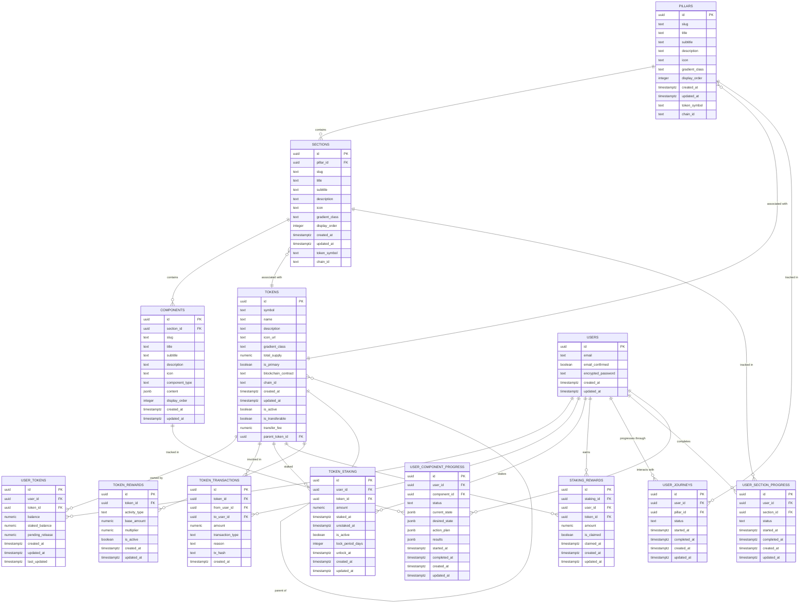
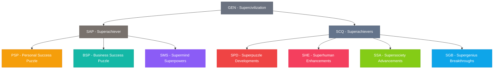
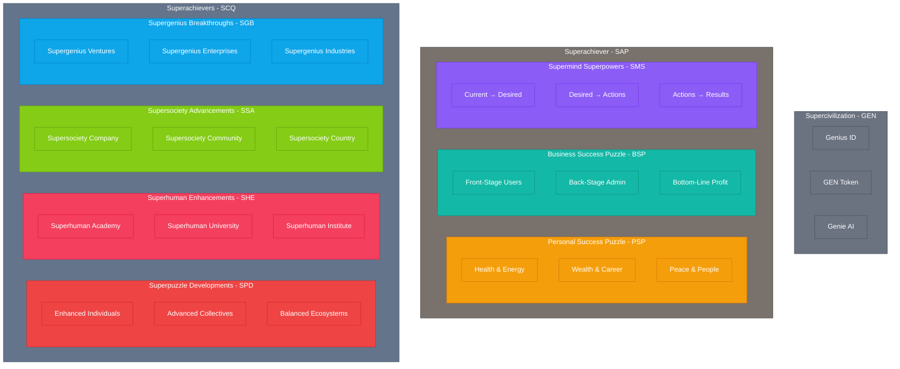
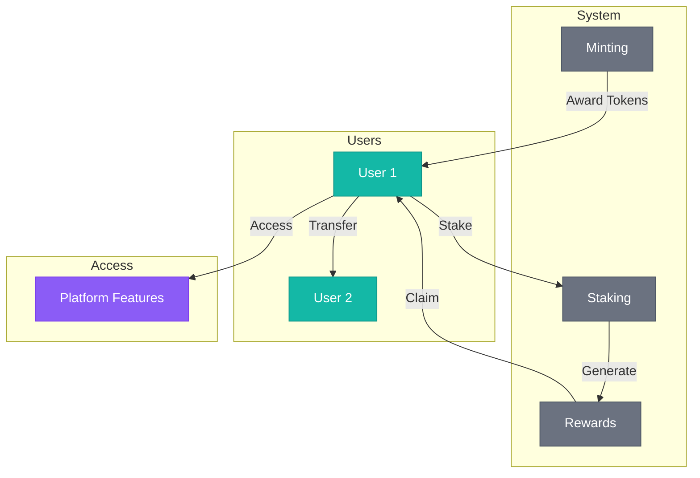

# Avolve Database Entity-Relationship Diagram

This document provides a visual representation of the Avolve platform's database schema, focusing on the token-based access system and its relationship to the platform's three main pillars.

## Token System ERD

## Token Hierarchy Diagram

## Platform Structure Diagram

## Token Flow Diagram

These diagrams provide a visual representation of the Avolve database schema, token hierarchy, platform structure, and token flow. They can be rendered using Mermaid.js, which is supported by many Markdown viewers and documentation platforms.
