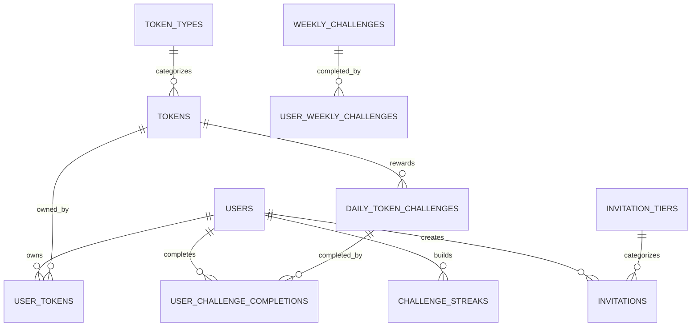

# Avolve Platform Database Schema

> **Version:** 2.0.0  
> **Last Updated:** April 8, 2025  
> **Status:** Production-Ready

This document provides a comprehensive overview of the Avolve platform's database schema, with a focus on the challenge and invitation systems. It's intended for developers who need to understand the data structure to build or extend platform features.

## Overview

The Avolve platform uses Supabase PostgreSQL for data storage, implementing Row Level Security (RLS) policies to ensure data protection. The schema is designed around the platform's three main pillars:

1. **Superachiever** - Individual journey of transformation
2. **Superachievers** - Collective journey of transformation
3. **Supercivilization** - Ecosystem journey of transformation

## Core Tables

### User Management

#### `profiles`
Stores extended user information beyond Supabase Auth.

```sql
create table public.profiles (
  id uuid primary key references auth.users(id) on delete cascade,
  username text unique,
  full_name text,
  avatar_url text,
  updated_at timestamp with time zone default now()
);
```

#### `user_permissions`
Maps users to specific permissions.

```sql
create table public.user_permissions (
  id uuid primary key default gen_random_uuid(),
  user_id uuid not null references auth.users(id) on delete cascade,
  resource text not null,
  action text not null,
  created_at timestamp with time zone default now(),
  unique (user_id, resource, action)
);
```

### Token System

#### `tokens`
Defines all token types in the system.

```sql
create table public.tokens (
  id uuid primary key default gen_random_uuid(),
  symbol text not null unique,
  name text not null,
  description text,
  is_active boolean not null default true,
  is_transferable boolean not null default true,
  token_type_id uuid references public.token_types(id),
  gradient text,
  created_at timestamp with time zone default now(),
  updated_at timestamp with time zone default now()
);
```

#### `token_types`
Categorizes tokens into hierarchical types.

```sql
create table public.token_types (
  id uuid primary key default gen_random_uuid(),
  code text not null unique,
  name text not null,
  description text,
  parent_token_type_id uuid references public.token_types(id),
  created_at timestamp with time zone default now(),
  updated_at timestamp with time zone default now()
);
```

#### `user_tokens`
Tracks token ownership for each user.

```sql
create table public.user_tokens (
  id uuid primary key default gen_random_uuid(),
  user_id uuid not null references auth.users(id) on delete cascade,
  token_id uuid not null references public.tokens(id) on delete cascade,
  amount numeric not null default 0,
  is_locked boolean not null default true,
  last_claimed timestamp with time zone,
  created_at timestamp with time zone default now(),
  updated_at timestamp with time zone default now(),
  unique (user_id, token_id)
);
```

#### `token_transactions`
Records all token transactions.

```sql
create table public.token_transactions (
  id uuid primary key default gen_random_uuid(),
  from_user_id uuid references auth.users(id) on delete set null,
  to_user_id uuid references auth.users(id) on delete set null,
  token_id uuid not null references public.tokens(id) on delete cascade,
  amount numeric not null,
  transaction_type text not null,
  reason text,
  status text not null default 'completed',
  created_at timestamp with time zone default now()
);
```

## Challenge System

### Daily Challenges

#### `daily_token_challenges`
Defines daily challenges for specific tokens.

```sql
create table public.daily_token_challenges (
  id uuid primary key default gen_random_uuid(),
  reward_id uuid not null references public.tokens(id),
  challenge_name text not null,
  challenge_description text not null,
  completion_criteria jsonb not null,
  bonus_amount numeric not null default 5,
  is_active boolean not null default true,
  created_at timestamp with time zone default now(),
  updated_at timestamp with time zone default now()
);
```

#### `user_challenge_completions`
Records when users complete daily challenges.

```sql
create table public.user_challenge_completions (
  id uuid primary key default gen_random_uuid(),
  user_id uuid not null references auth.users(id) on delete cascade,
  challenge_id uuid not null references public.daily_token_challenges(id),
  completion_date date not null,
  bonus_claimed boolean not null default false,
  created_at timestamp with time zone default now()
);
```

### Weekly Challenges

#### `weekly_challenges`
Defines weekly challenges for specific tokens.

```sql
create table public.weekly_challenges (
  id uuid primary key default gen_random_uuid(),
  token_type text not null,
  challenge_name text not null,
  challenge_description text not null,
  completion_criteria jsonb not null,
  reward_amount numeric not null default 0,
  streak_bonus_multiplier numeric not null default 1.0,
  is_active boolean not null default true,
  start_date timestamp with time zone not null,
  end_date timestamp with time zone not null,
  created_at timestamp with time zone default now(),
  updated_at timestamp with time zone default now()
);
```

#### `user_weekly_challenges`
Records when users complete weekly challenges.

```sql
create table public.user_weekly_challenges (
  id uuid primary key default gen_random_uuid(),
  user_id uuid not null references auth.users(id) on delete cascade,
  challenge_id uuid not null references public.weekly_challenges(id),
  completion_date date not null,
  reward_claimed boolean not null default false,
  created_at timestamp with time zone default now(),
  unique (user_id, challenge_id)
);
```

### Challenge Streaks

#### `challenge_streaks`
Tracks user streaks for each token type.

```sql
create table public.challenge_streaks (
  id uuid primary key default gen_random_uuid(),
  user_id uuid not null references auth.users(id) on delete cascade,
  token_type text not null,
  current_daily_streak integer not null default 0,
  longest_daily_streak integer not null default 0,
  current_weekly_streak integer not null default 0,
  longest_weekly_streak integer not null default 0,
  last_daily_completion_date date,
  last_weekly_completion_date date,
  created_at timestamp with time zone default now(),
  updated_at timestamp with time zone default now(),
  unique (user_id, token_type)
);
```

## Invitation System

#### `invitation_tiers`
Defines different invitation tiers with varying benefits.

```sql
create table public.invitation_tiers (
  id uuid primary key default gen_random_uuid(),
  tier_name text not null unique,
  token_cost numeric not null default 0,
  token_type text not null,
  max_invites integer not null default 1,
  validity_days integer not null default 7,
  reward_multiplier numeric not null default 1.0,
  description text,
  created_at timestamp with time zone default now(),
  updated_at timestamp with time zone default now()
);
```

#### `invitations`
Stores invitation codes and their status.

```sql
create table public.invitations (
  id uuid primary key default gen_random_uuid(),
  code text not null unique,
  created_by uuid references auth.users(id) on delete set null,
  email text,
  status text not null default 'pending',
  created_at timestamp with time zone default now(),
  expires_at timestamp with time zone default (now() + '14 days'::interval),
  accepted_at timestamp with time zone,
  invitee_id uuid references auth.users(id) on delete set null,
  reward_amount numeric not null default 0,
  reward_token_id uuid references public.tokens(id) on delete set null,
  reward_claimed boolean not null default false,
  reward_claimed_at timestamp with time zone,
  invitation_tier text not null default 'standard'
);
```

## Feature Unlocks

#### `feature_unlocks`
Records which features are unlocked for each user.

```sql
create table public.feature_unlocks (
  id uuid primary key default gen_random_uuid(),
  user_id uuid not null references auth.users(id) on delete cascade,
  feature_name text not null,
  unlocked_at timestamp with time zone default now(),
  unlock_reason text,
  created_at timestamp with time zone default now(),
  unique (user_id, feature_name)
);
```

#### `feature_unlock_criteria`
Defines the criteria for unlocking features.

```sql
create table public.feature_unlock_criteria (
  id uuid primary key default gen_random_uuid(),
  feature_name text not null unique,
  description text not null,
  criteria jsonb not null,
  created_at timestamp with time zone default now()
);
```

## Key Relationships

The database schema implements several important relationships:

1. **User → Tokens**: Users own tokens through the `user_tokens` table
2. **User → Challenges**: Users complete challenges through the `user_challenge_completions` table
3. **User → Streaks**: Users build streaks through the `challenge_streaks` table
4. **User → Invitations**: Users create and accept invitations through the `invitations` table
5. **Tokens → Challenges**: Challenges reward specific tokens through the `reward_id` field
6. **Invitation Tiers → Invitations**: Invitations belong to specific tiers through the `invitation_tier` field

## Row Level Security (RLS) Policies

All tables implement Row Level Security (RLS) policies to ensure users can only access data they are authorized to see. Here are key policies:

### Challenge RLS Policies

```sql
-- Everyone can view daily challenges
create policy "Everyone can view daily challenges"
on public.daily_token_challenges
for select using (true);

-- Users can view their own challenge completions
create policy "Users can view their own challenge completions"
on public.user_challenge_completions
for select using (user_id = auth.uid());

-- Users can insert their own challenge completions
create policy "Users can insert their own challenge completions"
on public.user_challenge_completions
for insert with check (user_id = auth.uid());

-- Users can view their own challenge streaks
create policy "Users can view their own challenge streaks"
on public.challenge_streaks
for select using (user_id = auth.uid());
```

### Invitation RLS Policies

```sql
-- Users can view invitations they created
create policy "Users can view invitations they created"
on public.invitations
for select using (auth.uid() = created_by);

-- Users can create invitations
create policy "Users can create invitations"
on public.invitations
for insert with check (auth.uid() = created_by);

-- Invitation tiers are viewable by authenticated users
create policy "Invitation tiers are viewable by authenticated users"
on public.invitation_tiers
for select using (true);
```

## Database Functions

The platform uses PostgreSQL functions to implement business logic. Here are key functions:

### Challenge Functions

```sql
-- Calculate streak bonus based on Tesla's 3-6-9 pattern
create or replace function public.calculate_streak_bonus(streak_count integer)
returns numeric
language plpgsql
security invoker
set search_path = ''
as $$
declare
  bonus_multiplier numeric;
begin
  -- Tesla's 3-6-9 pattern for streak bonuses
  if streak_count % 9 = 0 then
    bonus_multiplier := 3.0; -- Triple bonus at multiples of 9
  elsif streak_count % 6 = 0 then
    bonus_multiplier := 2.0; -- Double bonus at multiples of 6
  elsif streak_count % 3 = 0 then
    bonus_multiplier := 1.5; -- 50% bonus at multiples of 3
  else
    bonus_multiplier := 1.0; -- Regular reward
  end if;
  
  return bonus_multiplier;
end;
$$;
```

### Invitation Functions

```sql
-- Generate unique invitation code
create or replace function public.generate_unique_invitation_code(length integer default 8)
returns text
language plpgsql
security invoker
set search_path = ''
as $$
declare
  chars text := 'ABCDEFGHJKLMNPQRSTUVWXYZ23456789';
  result text := '';
  i integer := 0;
  code_exists boolean;
begin
  -- Generate a random code
  for i in 1..length loop
    result := result || substr(chars, floor(random() * length(chars) + 1)::integer, 1);
  end loop;
  
  -- Check if code already exists
  select exists(
    select 1 from public.invitations where code = result
  ) into code_exists;
  
  -- If code exists, recursively try again
  if code_exists then
    return public.generate_unique_invitation_code(length);
  end if;
  
  return result;
end;
$$;
```

## Database Indexes

The schema includes several indexes to optimize query performance:

```sql
-- Challenge indexes
create index idx_daily_token_challenges_reward on public.daily_token_challenges(reward_id);
create index idx_user_challenge_completions_user on public.user_challenge_completions(user_id);
create index idx_user_challenge_completions_challenge on public.user_challenge_completions(challenge_id);
create index idx_user_challenge_completions_date on public.user_challenge_completions(completion_date);
create index idx_weekly_challenges_token_type on public.weekly_challenges(token_type);
create index idx_weekly_challenges_date_range on public.weekly_challenges(start_date, end_date);
create index idx_challenge_streaks_token_type on public.challenge_streaks(token_type);

-- Invitation indexes
create index idx_invitations_code on public.invitations(code);
create index idx_invitations_created_by on public.invitations(created_by);
create index idx_invitations_status on public.invitations(status);
create index idx_invitations_expires_at on public.invitations(expires_at);
create index idx_invitations_tier on public.invitations(invitation_tier);
create index idx_invitations_pending on public.invitations(created_at) where status = 'pending';
create index idx_invitations_unclaimed_rewards on public.invitations(created_by) where reward_claimed = false and status = 'accepted';
```

## Materialized Views

The schema includes a materialized view for challenge statistics to improve dashboard performance:

```sql
create materialized view public.challenge_statistics as
select
  c.token_type,
  count(distinct uc.user_id) as total_participants,
  count(uc.id) as total_completions,
  avg(cs.current_daily_streak) as avg_daily_streak,
  avg(cs.current_weekly_streak) as avg_weekly_streak,
  max(cs.longest_daily_streak) as max_daily_streak,
  max(cs.longest_weekly_streak) as max_weekly_streak
from
  public.weekly_challenges c
  left join public.user_weekly_challenges uc on c.id = uc.challenge_id
  left join public.challenge_streaks cs on cs.token_type = c.token_type
group by
  c.token_type;
```

## Database Migrations

The Avolve platform uses Supabase migrations to manage database schema changes. Migrations are stored in the `supabase/migrations` directory and follow the naming convention:

```
YYYYMMDDHHmmss_short_description.sql
```

To apply migrations, use the Supabase CLI:

```bash
supabase migration up
```

## Seeding Test Data

For development purposes, you can seed the database with test data using the following command:

```bash
supabase db seed
```

The seed data includes:
- Sample tokens and token types
- Test users with various permission levels
- Example daily and weekly challenges
- Sample invitation tiers and codes

## Best Practices

When working with the Avolve database:

1. **Always use RLS policies** to secure data access
2. **Set search_path = ''** in all database functions
3. **Use fully qualified names** (schema.table) in SQL queries
4. **Create appropriate indexes** for frequently queried columns
5. **Implement proper error handling** in database functions
6. **Document all schema changes** in migration files
7. **Test migrations** thoroughly before applying to production

## Diagram

Below is a simplified entity-relationship diagram of the core tables:



## Conclusion

This database schema documentation provides a comprehensive overview of the Avolve platform's data structure, with a focus on the challenge and invitation systems. By following these guidelines and best practices, you can effectively work with the platform's database and extend its functionality.

---

*For more information, see the [Architecture Overview](./architecture.md) and [Developer Guide](./developer-guide.md).*
