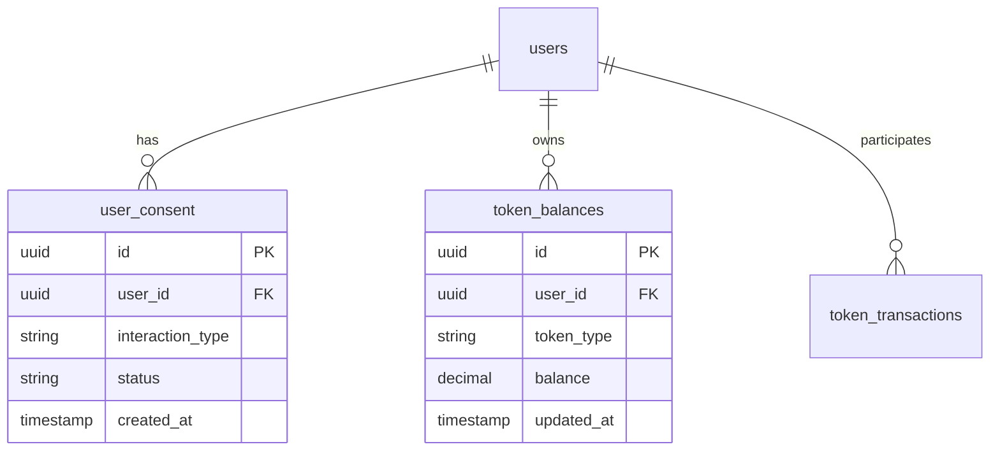

# Database Documentation

## Overview

The Avolve platform uses Supabase (PostgreSQL) as its primary database, implementing Row Level Security (RLS) and following sacred geometry principles in its schema design.

## Schema Design

### Core Tables

1. **Users**
   - Stores user profiles and authentication data
   - Implements RLS for data access
   - Links to all user-related data

2. **Consent Records**
   - Tracks user consent for various interactions
   - Implements strict ownership checks
   - Maintains audit trail

3. **Token System**
   - Tracks token balances and transactions
   - Implements 3-6-9 pattern for token categories
   - Ensures atomic transactions

### Schema Diagram



## Security

### Row Level Security (RLS)

1. **User Data**
```sql
create policy "Users can only access their own data"
on users
for all
using (auth.uid() = id);
```

2. **Consent Records**
```sql
create policy "Users can only view their own consent records"
on user_consent
for select
using (auth.uid() = user_id);
```

### Functions and Procedures

All database functions follow these principles:
- SECURITY INVOKER by default
- Explicit search_path
- Input validation
- Error handling
- Audit logging

Example:
```sql
create or replace function record_consent(
  p_user_id uuid,
  p_interaction_type text,
  p_terms text[]
)
returns uuid
language plpgsql
security invoker
set search_path = ''
as $$
declare
  v_consent_id uuid;
begin
  -- Implementation
end;
$$;
```

## Performance Optimization

### Indexes

1. **Primary Keys**
   - UUIDs for distributed systems
   - B-tree indexes for efficient lookups

2. **Foreign Keys**
   - Index all foreign key columns
   - Include commonly queried columns

3. **Composite Indexes**
   - Based on query patterns
   - Consider column order

### Query Optimization

1. **Common Patterns**
```sql
-- Efficient user consent lookup
select c.*
from public.user_consent c
where c.user_id = auth.uid()
  and c.interaction_type = 'governance_proposal'
  and c.created_at >= date_trunc('day', now());
```

2. **Materialized Views**
```sql
create materialized view user_stats as
select user_id,
       count(*) as total_consents,
       sum(case when status = 'approved' then 1 else 0 end) as approved_count
from public.user_consent
group by user_id;
```

## Migrations

### Structure

```
supabase/migrations/
├── 20250411000000_initial_schema.sql
├── 20250411000001_add_consent_table.sql
└── 20250411000002_add_token_system.sql
```

### Best Practices

1. **Naming**
   - Timestamp prefix (YYYYMMDDHHmmss)
   - Descriptive suffix
   - Lowercase with underscores

2. **Content**
   - Single responsibility
   - Idempotent changes
   - Proper documentation
   - Rollback procedures

3. **Testing**
   - Test on development branch
   - Verify RLS policies
   - Check data integrity

## Monitoring

### Key Metrics

1. **Performance**
   - Query execution time
   - Index usage
   - Cache hit ratio

2. **Storage**
   - Table sizes
   - Index sizes
   - Growth rate

3. **Connections**
   - Active connections
   - Connection pool usage
   - Long-running queries

### Maintenance

1. **Regular Tasks**
   - VACUUM ANALYZE
   - Reindex when needed
   - Update statistics

2. **Backup Strategy**
   - Daily full backups
   - Point-in-time recovery
   - Retention policy

## Resources

- [Supabase Documentation](https://supabase.com/docs)
- [PostgreSQL Documentation](https://www.postgresql.org/docs/)
- [Database Migration Guide](../guides/database-migration.md)
- [Performance Tuning Guide](performance.md)
