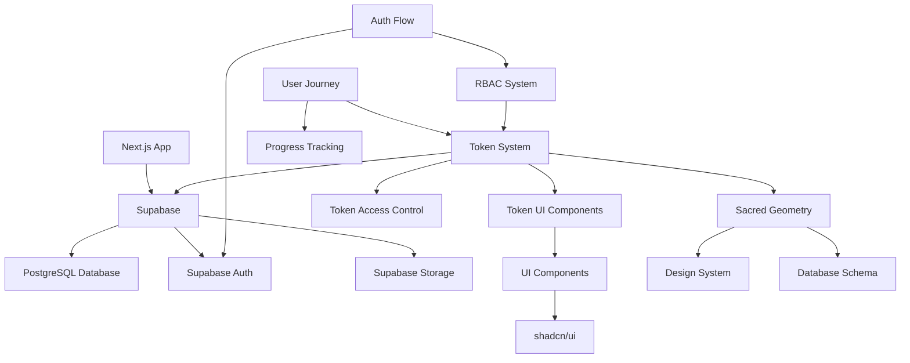
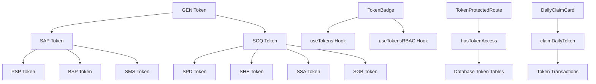
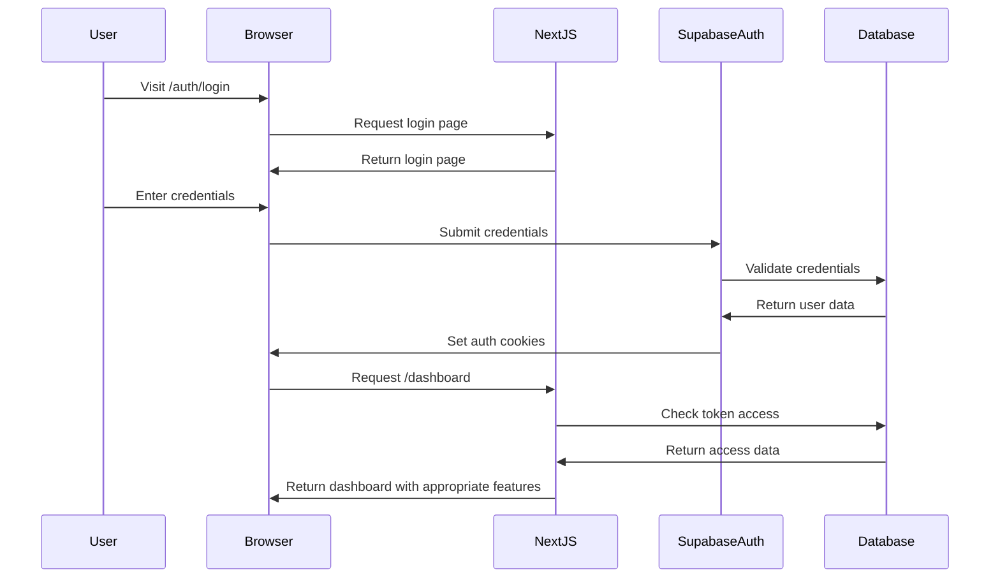
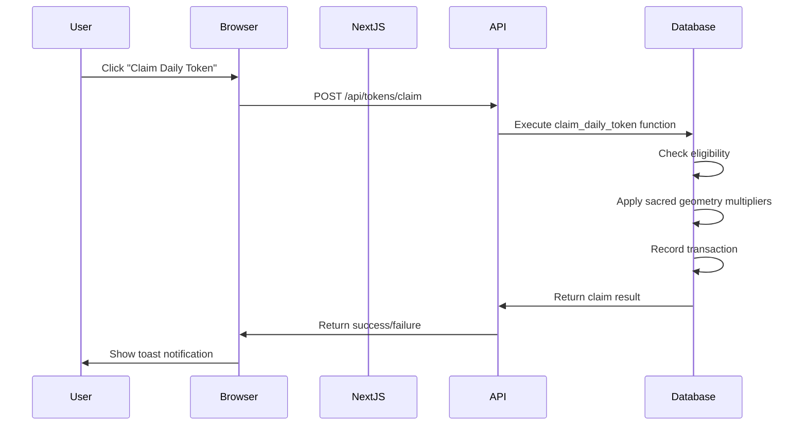
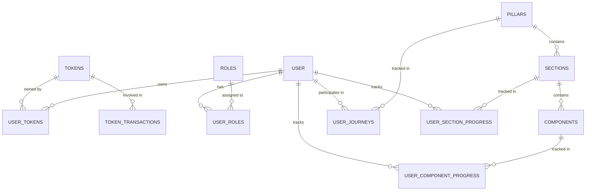

# Avolve Platform Dependency Map

This document provides a comprehensive map of dependencies and relationships between key components of the Avolve platform. This map is designed to help AI assistants like Cascade and Grok understand the system architecture and component relationships.

## Core System Dependencies

## Token System Dependencies

## File Dependencies

### Frontend Components

| Component             | Dependencies       | Database Tables                               | Hooks                        |
| --------------------- | ------------------ | --------------------------------------------- | ---------------------------- |
| `TokenBadge`          | `Badge`, `Tooltip` | `tokens`, `user_tokens`                       | `useTokens`, `useTokensRBAC` |
| `DailyClaimCard`      | `Card`, `Button`   | `tokens`, `user_tokens`, `token_transactions` | `useTokens`, `useToast`      |
| `TokenProtectedRoute` | `Redirect`         | `tokens`, `user_tokens`                       | `useTokensRBAC`              |
| `TokenDisplay`        | `TokenBadge`       | `tokens`, `user_tokens`                       | `useTokens`                  |
| `JourneyDashboard`    | `Progress`         | `pillars`, `user_journeys`                    | `useJourney`                 |

### API Routes

| Route                   | Dependencies                              | Database Tables                               | External APIs |
| ----------------------- | ----------------------------------------- | --------------------------------------------- | ------------- |
| `/api/tokens/claim`     | `createClient`, `claimDailyToken`         | `tokens`, `user_tokens`, `token_transactions` | None          |
| `/api/tokens/balance`   | `createClient`, `getUserTokenBalance`     | `tokens`, `user_tokens`                       | None          |
| `/api/journey/progress` | `createClient`, `updateComponentProgress` | `user_component_progress`                     | None          |
| `/api/auth/csrf/token`  | `createClient`                            | `auth.users`                                  | None          |
| `/api/chat`             | `StreamingTextResponse`, `OpenAIStream`   | `chat_history`                                | OpenAI API    |

### Database Functions

| Function                    | Dependencies       | Tables Accessed                                                                                          | Called By                |
| --------------------------- | ------------------ | -------------------------------------------------------------------------------------------------------- | ------------------------ |
| `has_token_access`          | None               | `tokens`, `user_tokens`                                                                                  | `hasTokenAccess` utility |
| `claim_daily_token`         | `get_digital_root` | `tokens`, `user_tokens`, `token_transactions`                                                            | `/api/tokens/claim`      |
| `update_component_progress` | None               | `components`, `user_component_progress`                                                                  | `/api/journey/progress`  |
| `get_user_progress_summary` | None               | `pillars`, `sections`, `components`, `user_journeys`, `user_section_progress`, `user_component_progress` | `/api/journey/summary`   |

## Authentication Flow

## Token Claim Flow

## Database Schema Relationships

## Sacred Geometry Implementation

The sacred geometry principles are implemented throughout the codebase in the following ways:

1. **Token Hierarchy** - Follows Tesla's 3-6-9 pattern with three main token categories
2. **UI Components** - Use golden ratio (1.618) for sizing and spacing
3. **Database Schema** - Uses digital root calculations and Fibonacci sequences
4. **Token Values** - Exchange rates follow the golden ratio
5. **Reward System** - Uses Fibonacci sequence for natural progression

## Key Integration Points

These are the critical integration points where different systems connect:

1. **Token System ↔ RBAC** - Token ownership determines feature access
2. **Journey System ↔ Token System** - Progress unlocks tokens and vice versa
3. **UI Components ↔ Database** - Components fetch and display data from database
4. **Auth System ↔ Token System** - User authentication enables token claims
5. **Sacred Geometry ↔ All Systems** - Mathematical principles applied throughout

## Conclusion

This dependency map provides a comprehensive overview of the relationships between different components of the Avolve platform. Understanding these relationships is essential for effectively working with the codebase and making changes that respect the existing architecture.
