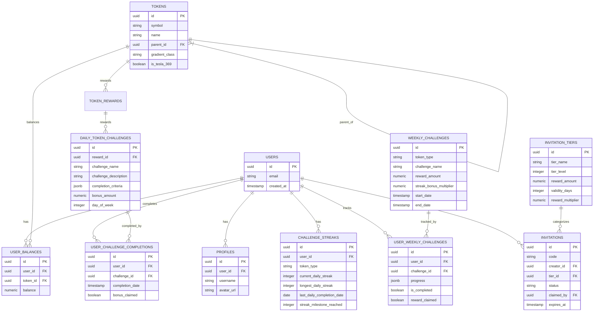

# Avolve Platform Diagrams

This document contains Mermaid.js diagram code for visualizing key aspects of the Avolve platform. These diagrams can be embedded in documentation or viewed using a Mermaid renderer.

## Table of Contents

1. [Challenge Flow Diagram](#challenge-flow-diagram)
2. [Invitation System Flow](#invitation-system-flow)
3. [Tesla's 3-6-9 Streak Pattern](#teslas-3-6-9-streak-pattern)
4. [Token Hierarchy](#token-hierarchy)
5. [Database Schema Relationships](#database-schema-relationships)
6. [Invitation Redemption Process](#invitation-redemption-process)
7. [Challenge Completion Flow](#challenge-completion-flow)
8. [Token Hierarchy Visualization](#token-hierarchy-visualization)

## Challenge Flow Diagram

## Invitation System Flow

## Tesla's 3-6-9 Streak Pattern

## Token Hierarchy

## Database Schema Relationships

## Invitation Redemption Process

## Challenge Completion Flow

## Token Hierarchy Visualization

You can render these diagrams using:
- GitHub (which supports Mermaid natively in markdown)
- [Mermaid Live Editor](https://mermaid.live/)
- VS Code with the Mermaid extension
- Any documentation tool that supports Mermaid syntax
