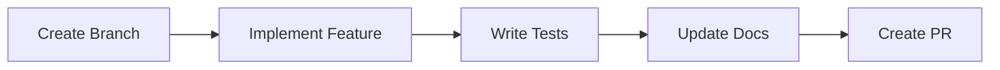

# Avolve Developer Guide 2025

Copyright 2025 Avolve DAO. All rights reserved.

> **Suggest an Improvement:** [Open an issue](https://github.com/avolve-xyz/avolve/issues/new/choose) or [send feedback](mailto:admin@avolve.io) to help us make these docs even better!

## Table of Contents

1. [Introduction](#introduction)
2. [Architecture Overview](#architecture-overview)
3. [Getting Started](#getting-started)
4. [Development Workflow](#development-workflow)
5. [Best Practices](#best-practices)
6. [Security Guidelines](#security-guidelines)
7. [Testing Strategy](#testing-strategy)
8. [Deployment](#deployment)
9. [Troubleshooting](#troubleshooting)
10. [Contact & Support](#contact--support)
11. [FAQ](#faq)
12. [Why Build on Avolve](#why-build-on-avolve)

## Introduction

Welcome to the Avolve platform developer guide. This comprehensive guide covers everything you need to know to develop features, fix bugs, and maintain the platform effectively.

## Architecture Overview

Avolve uses a modern tech stack optimized for performance and developer experience:

- **Frontend**: Next.js 14+ with App Router
- **Backend**: Supabase with PostgreSQL
- **Authentication**: Supabase Auth
- **State Management**: React Server Components + Client Hooks
- **Styling**: Tailwind CSS + Shadcn/UI

### Key Directories

```
/app
  /(authenticated)     # Protected routes
    /super/           # Main feature routes
  /(unauthenticated)  # Public routes
  /api               # API routes
/components          # React components
/lib                 # Shared utilities
/hooks               # React hooks
/styles              # Global styles
/public              # Static assets
/supabase           # Database definitions
/config             # Configuration
/data               # Application data
```

## Getting Started

1. **Environment Setup**

   ```bash
   # Install dependencies
   pnpm install

   # Set up environment variables
   cp .env.example .env.local

   # Start development server
   pnpm dev
   ```

2. **Database Setup**

   ```bash
   # Start Supabase
   supabase start

   # Apply migrations
   supabase db push
   ```

## Development Workflow

### 1. Feature Development



### 2. Code Organization

- Use feature-based organization
- Keep components small and focused
- Follow the Single Responsibility Principle

### 3. State Management

```typescript
// Server Component
async function DataWrapper() {
  const data = await fetchData()
  return <ClientComponent initialData={data} />
}

// Client Component
'use client'
function ClientComponent({ initialData }) {
  const [data, setData] = useState(initialData)
  // Component logic
}
```

## Best Practices

### 1. TypeScript

- Use strict type checking
- Define interfaces for all props
- Avoid any type

### 2. React Patterns

- Use React Server Components for data fetching
- Keep client components focused on interactivity
- Implement proper error boundaries

### 3. Database

- Use Row Level Security
- Implement proper indexing
- Write efficient queries

### 4. Testing

- Write unit tests for utilities
- Integration tests for components
- E2E tests for critical paths

## Security Guidelines

1. **Authentication**

   - Use Supabase Auth
   - Implement proper role-based access
   - Secure API routes

2. **Database**

   - Enable Row Level Security
   - Use prepared statements
   - Implement rate limiting

3. **API**
   - Validate all inputs
   - Use proper HTTP methods
   - Implement CORS policies

## Testing Strategy

1. **Unit Testing**

   ```typescript
   import { describe, it, expect } from 'vitest';

   describe('utility', () => {
     it('should work correctly', () => {
       expect(result).toBe(expected);
     });
   });
   ```

2. **Integration Testing**

   ```typescript
   import { render, screen } from '@testing-library/react'

   test('component renders correctly', () => {
     render(<Component />)
     expect(screen.getByRole('button')).toBeInTheDocument()
   })
   ```

## Deployment

1. **Production Deployment**

   ```bash
   # Build application
   pnpm build

   # Deploy to production
   pnpm deploy
   ```

2. **Database Migrations**

   ```bash
   # Create migration
   supabase migration new feature_name

   # Apply migration
   supabase db push
   ```

## Troubleshooting

- If you encounter build errors, check the [README Quick Start](../../README.md#quick-start) and ensure all dependencies are installed.
- For Supabase issues, verify your `.env.local` and Supabase project status.
- See [FAQ](#faq) below for common problems.

## Contact & Support

- For dev support, open an issue or contact dev@avolve.io

## FAQ

- **Q: The build fails with a missing dependency.**
  - A: Run `npm install` and check the package.json for required packages.
- **Q: Supabase auth is not working.**
  - A: Ensure your environment variables are set correctly and Supabase is running.

## Why Build on Avolve

Avolve enables developers and contributors to create, launch, and scale ventures with robust tools, security, and a vibrant community. [See why you should contribute.](../why-avolve.md)

## Additional Resources

- [API Documentation](/docs/api/README.md)
- [Database Guide](/docs/database/README.md)
- [UI Components](/docs/ui/README.md)
- [Testing Guide](/docs/testing/README.md)

## Contributing

See our [Contributing Guide](/docs/guides/contributing.md) for details on our development process and how to submit changes.

## License

Copyright 2025 Avolve DAO. All rights reserved.
