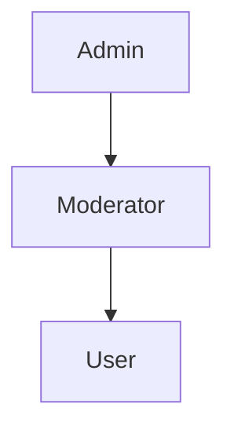

# Role-Based Access Control (RBAC) System

This document provides detailed information about the Role-Based Access Control (RBAC) system implemented in the Avolve platform.

## Overview

The Avolve platform implements a comprehensive RBAC system that provides fine-grained access control to resources based on user roles and permissions. The system supports role hierarchies, allowing for inheritance of permissions, which simplifies role management and provides a more flexible security model.

## Project Configuration

### Default Roles

```sql
-- System roles
create type public.user_role as enum (
  'user',
  'moderator',
  'admin'
);

-- Default role assignments
insert into public.roles (name, description, is_system)
values 
  ('user', 'Default user role with basic access', true),
  ('moderator', 'Community moderator with content management access', true),
  ('admin', 'System administrator with full access', true);
```

### Role Hierarchy



### Default Permissions

```sql
-- Core permissions
insert into public.permissions (resource, action, description)
values
  -- User management
  ('users', 'view', 'View user profiles'),
  ('users', 'edit', 'Edit user profiles'),
  ('users', 'delete', 'Delete user accounts'),
  
  -- Content management
  ('content', 'view', 'View content'),
  ('content', 'create', 'Create new content'),
  ('content', 'edit', 'Edit existing content'),
  ('content', 'delete', 'Delete content'),
  
  -- Token management
  ('tokens', 'view', 'View token balances'),
  ('tokens', 'transfer', 'Transfer tokens'),
  ('tokens', 'mint', 'Mint new tokens'),
  
  -- System management
  ('system', 'view', 'View system settings'),
  ('system', 'edit', 'Edit system settings');
```

### Role-Permission Mappings

```sql
-- User role permissions
insert into public.role_permissions (role_id, permission_id)
select r.id, p.id
from public.roles r
cross join public.permissions p
where r.name = 'user'
and p.resource || ':' || p.action in (
  'users:view',
  'content:view',
  'content:create',
  'tokens:view',
  'tokens:transfer'
);

-- Moderator role permissions
insert into public.role_permissions (role_id, permission_id)
select r.id, p.id
from public.roles r
cross join public.permissions p
where r.name = 'moderator'
and p.resource || ':' || p.action in (
  'users:view',
  'content:view',
  'content:create',
  'content:edit',
  'content:delete',
  'tokens:view',
  'tokens:transfer'
);

-- Admin role permissions (all permissions)
insert into public.role_permissions (role_id, permission_id)
select r.id, p.id
from public.roles r
cross join public.permissions p
where r.name = 'admin';
```

## Implementation

### Database Functions

```sql
-- Check if user has role
create or replace function public.has_role(role_name text)
returns boolean
language plpgsql
security invoker
set search_path = ''
as $$
begin
  return exists (
    select 1
    from public.user_roles ur
    join public.roles r on r.id = ur.role_id
    where ur.user_id = auth.uid()
    and r.name = role_name
  );
end;
$$;

-- Check if user has permission
create or replace function public.has_permission(resource text, action text)
returns boolean
language plpgsql
security invoker
set search_path = ''
as $$
begin
  -- Check if user is admin
  if exists (
    select 1 from public.user_roles ur
    join public.roles r on r.id = ur.role_id
    where ur.user_id = auth.uid()
    and r.name = 'admin'
  ) then
    return true;
  end if;

  -- Check specific permission
  return exists (
    select 1
    from public.user_roles ur
    join public.role_permissions rp on rp.role_id = ur.role_id
    join public.permissions p on p.id = rp.permission_id
    where ur.user_id = auth.uid()
    and p.resource = has_permission.resource
    and p.action = has_permission.action
  );
end;
$$;
```

### Row Level Security

```sql
-- Users table RLS
alter table public.users enable row level security;

-- Users can read all profiles
create policy "Users can read all profiles"
on public.users
for select
using (true);

-- Users can update own profile
create policy "Users can update own profile"
on public.users
for update
using (auth.uid() = id);

-- Content table RLS
alter table public.content enable row level security;

-- Everyone can read published content
create policy "Everyone can read published content"
on public.content
for select
using (status = 'published');

-- Authors can manage own content
create policy "Authors can manage own content"
on public.content
for all
using (auth.uid() = author_id);

-- Moderators can manage all content
create policy "Moderators can manage all content"
on public.content
for all
using (
  exists (
    select 1 from public.user_roles ur
    join public.roles r on r.id = ur.role_id
    where ur.user_id = auth.uid()
    and r.name in ('moderator', 'admin')
  )
);
```

### React Integration

```typescript
// hooks/useRBAC.ts
import { useCallback } from 'react'
import { createClient } from '@/lib/supabase/client'

export function useRBAC() {
  const supabase = createClient()

  const checkRole = useCallback(async (role: string) => {
    const { data, error } = await supabase
      .rpc('has_role', { role_name: role })
    
    if (error) {
      console.error('Error checking role:', error)
      return false
    }
    
    return data
  }, [supabase])

  const checkPermission = useCallback(async (
    resource: string,
    action: string
  ) => {
    const { data, error } = await supabase
      .rpc('has_permission', { resource, action })
    
    if (error) {
      console.error('Error checking permission:', error)
      return false
    }
    
    return data
  }, [supabase])

  return {
    checkRole,
    checkPermission
  }
}

// components/Authorized.tsx
import { ReactNode } from 'react'
import { useRBAC } from '@/hooks/useRBAC'

interface AuthorizedProps {
  children: ReactNode
  requiredRoles?: string[]
  requiredPermissions?: Array<{
    resource: string
    action: string
  }>
  fallback?: ReactNode
}

export function Authorized({
  children,
  requiredRoles = [],
  requiredPermissions = [],
  fallback = null
}: AuthorizedProps) {
  const { checkRole, checkPermission } = useRBAC()
  const [authorized, setAuthorized] = useState(false)

  useEffect(() => {
    const checkAccess = async () => {
      // Check roles
      if (requiredRoles.length > 0) {
        const roleChecks = await Promise.all(
          requiredRoles.map(role => checkRole(role))
        )
        if (!roleChecks.some(Boolean)) {
          setAuthorized(false)
          return
        }
      }

      // Check permissions
      if (requiredPermissions.length > 0) {
        const permissionChecks = await Promise.all(
          requiredPermissions.map(({ resource, action }) =>
            checkPermission(resource, action)
          )
        )
        if (!permissionChecks.every(Boolean)) {
          setAuthorized(false)
          return
        }
      }

      setAuthorized(true)
    }

    checkAccess()
  }, [requiredRoles, requiredPermissions])

  if (!authorized) return fallback

  return <>{children}</>
}
```

## Best Practices

1. **Role Assignment**
   - Follow principle of least privilege
   - Regularly audit role assignments
   - Use role hierarchy for inheritance

2. **Permission Management**
   - Keep permissions granular
   - Use descriptive resource:action pairs
   - Document all permissions

3. **Security**
   - Enable RLS on all tables
   - Implement proper error handling
   - Log access control events

4. **Performance**
   - Cache role/permission checks
   - Use database functions
   - Optimize queries

## Additional Resources

- [Supabase RLS Documentation](https://supabase.com/docs/guides/auth/row-level-security)
- [PostgreSQL RBAC Guide](https://www.postgresql.org/docs/current/ddl-rowsecurity.html)
- [Next.js Authentication](https://nextjs.org/docs/authentication)

## Support

For RBAC-related issues:
- Email: security@avolve.io
- Discord: [Avolve Security Channel](https://discord.gg/avolve-security)
- GitHub Issues: [Security Issues](https://github.com/avolve/platform/issues)
