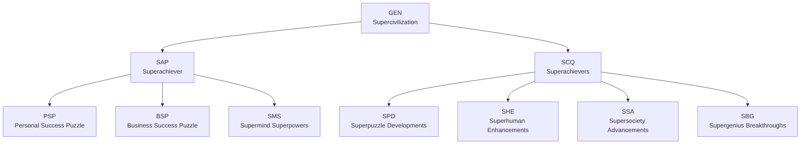

# Avolve Papers: The 10-Token Structure

Welcome to the living library of Avolve! This collection is organized around the 10-token architecture, representing the core journeys and value pillars of the platform: Supercivilization, Superachiever, and Superachievers.

## Token Structure Overview

## Papers by Token

| Token | Paper | Description |
|-------|-------|-------------|
| GEN   | [gen-supercivilization.md](gen-supercivilization.md) | Ecosystem journey, onboarding philosophy, platform vision |
| SAP   | [sap-superachiever.md](sap-superachiever.md) | Individual journey, personal transformation |
| SCQ   | [scq-superachievers.md](scq-superachievers.md) | Collective journey, co-creation |
| PSP   | [psp-personal-success.md](psp-personal-success.md) | Personal Success Puzzle |
| BSP   | [bsp-business-success.md](bsp-business-success.md) | Business Success Puzzle |
| SMS   | [sms-supermind-superpowers.md](sms-supermind-superpowers.md) | Supermind Superpowers |
| SPD   | [spd-superpuzzle-developments.md](spd-superpuzzle-developments.md) | Superpuzzle Developments |
| SHE   | [she-superhuman-enhancements.md](she-superhuman-enhancements.md) | Superhuman Enhancements |
| SSA   | [ssa-supersociety-advancements.md](ssa-supersociety-advancements.md) | Supersociety Advancements |
| SBG   | [sbg-supergenius-breakthroughs.md](sbg-supergenius-breakthroughs.md) | Supergenius Breakthroughs |

## How to Use This Library

- Start with [GEN — Supercivilization](gen-supercivilization.md) for the big picture, onboarding philosophy, and ecosystem vision.
- Dive into [SAP — Superachiever](sap-superachiever.md) and [SCQ — Superachievers](scq-superachievers.md) for individual and collective journeys.
- Explore each sub-token paper for focused insights and frameworks.
- All papers are living documents—feedback and peer review are welcome!

---

*For suggestions or contributions, open an issue or contact [admin@avolve.io](mailto:admin@avolve.io)*
